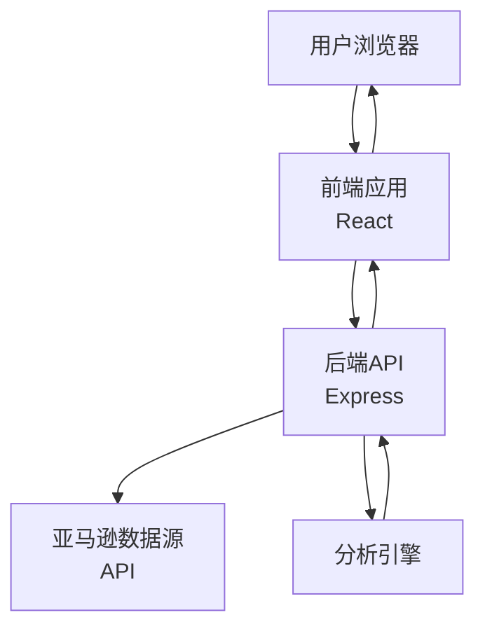

# 设计文档

## 概述

亚马逊选品分析系统是一个单页Web应用，采用前后端分离架构。用户通过简洁的界面输入ASIN，系统调用后端API获取亚马逊产品数据，经过分析引擎处理后，在前端展示详细的选品报告。

### 技术栈选择

- **前端**: React + TypeScript + Tailwind CSS
- **后端**: Node.js + Express
- **数据获取**: Amazon Product Advertising API 或第三方数据服务
- **部署**: 前端部署到Vercel/Netlify，后端部署到云服务器

## 架构

### 系统架构图



### 架构说明

1. **前端层**: 负责用户交互、数据展示和状态管理
2. **后端API层**: 处理业务逻辑、数据获取和分析协调
3. **数据获取层**: 与亚马逊API或第三方服务交互
4. **分析引擎**: 独立的分析模块，评估产品各维度指标

## 组件和接口

### 前端组件结构

```
src/
├── components/
│   ├── AsinInput.tsx          # ASIN输入组件
│   ├── AnalyzeButton.tsx      # 分析按钮组件
│   ├── LoadingSpinner.tsx     # 加载状态组件
│   ├── ErrorMessage.tsx       # 错误提示组件
│   ├── ProductReport.tsx      # 报告容器组件
│   │   ├── ProductBasicInfo.tsx    # 产品基本信息
│   │   ├── AnalysisConclusion.tsx  # 分析结论
│   │   └── AnalysisDetails.tsx     # 分析详情
│   └── Layout.tsx             # 页面布局组件
├── services/
│   └── api.ts                 # API调用服务
├── types/
│   └── index.ts               # TypeScript类型定义
├── utils/
│   └── validators.ts          # 验证工具函数
└── App.tsx                    # 主应用组件
```

### 后端模块结构

```
src/
├── routes/
│   └── analyze.ts             # 分析路由
├── services/
│   ├── amazonDataService.ts   # 亚马逊数据获取服务
│   └── analysisService.ts     # 分析服务
├── analyzers/
│   ├── competitionAnalyzer.ts # 竞争分析器
│   ├── priceAnalyzer.ts       # 价格分析器
│   └── demandAnalyzer.ts      # 需求分析器
├── types/
│   └── index.ts               # TypeScript类型定义
└── server.ts                  # 服务器入口
```

### API接口设计

#### POST /api/analyze

分析指定ASIN的产品

**请求体:**
```json
{
  "asin": "B08N5WRWNW"
}
```

**响应体 (成功):**
```json
{
  "success": true,
  "data": {
    "productInfo": {
      "asin": "B08N5WRWNW",
      "title": "产品标题",
      "imageUrl": "https://...",
      "price": 29.99,
      "currency": "USD",
      "rating": 4.5,
      "reviewCount": 1234,
      "salesRank": 5678,
      "category": "Electronics"
    },
    "analysis": {
      "conclusion": "recommended",
      "overallScore": 75,
      "dimensions": {
        "competition": {
          "score": 70,
          "level": "medium",
          "description": "市场竞争适中，有进入空间"
        },
        "pricing": {
          "score": 80,
          "profitMargin": "30-40%",
          "description": "价格区间合理，利润空间充足"
        },
        "demand": {
          "score": 75,
          "level": "high",
          "description": "销售排名靠前，市场需求旺盛"
        }
      }
    }
  }
}
```

**响应体 (失败):**
```json
{
  "success": false,
  "error": {
    "code": "INVALID_ASIN",
    "message": "提供的ASIN格式无效"
  }
}
```

## 数据模型

### ProductInfo (产品信息)

```typescript
interface ProductInfo {
  asin: string;              // ASIN码
  title: string;             // 产品标题
  imageUrl: string;          // 主图URL
  price: number;             // 价格
  currency: string;          // 货币单位
  rating: number;            // 评分 (0-5)
  reviewCount: number;       // 评论数量
  salesRank: number;         // 销售排名
  category: string;          // 产品类目
}
```

### AnalysisResult (分析结果)

```typescript
interface AnalysisResult {
  conclusion: 'recommended' | 'not_recommended';  // 结论
  overallScore: number;                           // 综合评分 (0-100)
  dimensions: {
    competition: DimensionAnalysis;               // 竞争分析
    pricing: DimensionAnalysis;                   // 价格分析
    demand: DimensionAnalysis;                    // 需求分析
  };
}

interface DimensionAnalysis {
  score: number;              // 维度评分 (0-100)
  level?: string;             // 等级描述
  profitMargin?: string;      // 利润率（仅价格维度）
  description: string;        // 详细说明
}
```

### AnalyzeResponse (API响应)

```typescript
interface AnalyzeResponse {
  success: boolean;
  data?: {
    productInfo: ProductInfo;
    analysis: AnalysisResult;
  };
  error?: {
    code: string;
    message: string;
  };
}
```

## 分析引擎逻辑

### 竞争分析 (Competition Analysis)

**评估指标:**
- 评论数量: < 100 (低竞争), 100-1000 (中竞争), > 1000 (高竞争)
- 平均评分: > 4.5 (竞争激烈), 3.5-4.5 (适中), < 3.5 (机会大)
- Top 10卖家集中度

**评分规则:**
- 评论数少且评分不高: 80-100分 (推荐)
- 评论数适中: 50-79分 (谨慎)
- 评论数多且评分高: 0-49分 (不推荐)

### 价格分析 (Pricing Analysis)

**评估指标:**
- 产品价格区间
- 预估成本 (价格的40-60%)
- 预估利润率

**评分规则:**
- 利润率 > 40%: 80-100分
- 利润率 30-40%: 60-79分
- 利润率 < 30%: 0-59分

### 需求分析 (Demand Analysis)

**评估指标:**
- 销售排名 (BSR - Best Sellers Rank)
- 类目规模

**评分规则:**
- BSR < 10000: 80-100分 (需求旺盛)
- BSR 10000-50000: 50-79分 (需求适中)
- BSR > 50000: 0-49分 (需求较低)

### 综合结论

**推荐逻辑:**
- 综合评分 >= 70: 推荐
- 综合评分 < 70: 不推荐

**综合评分计算:**
```
综合评分 = (竞争分析 × 0.4) + (价格分析 × 0.3) + (需求分析 × 0.3)
```

## 错误处理

### 错误类型

1. **INVALID_ASIN**: ASIN格式无效
2. **PRODUCT_NOT_FOUND**: 产品不存在
3. **API_ERROR**: 亚马逊API调用失败
4. **RATE_LIMIT**: API调用频率超限
5. **SERVER_ERROR**: 服务器内部错误

### 错误处理策略

- 前端验证ASIN格式，减少无效请求
- API调用失败时，提供重试机制（最多3次）
- 显示用户友好的错误信息
- 记录详细错误日志用于调试

## 测试策略

### 单元测试

- ASIN验证函数测试
- 各分析器的评分逻辑测试
- API响应数据转换测试

### 集成测试

- 完整的分析流程测试
- API端到端测试
- 错误场景测试

### 前端测试

- 组件渲染测试
- 用户交互测试
- 响应式布局测试

### 性能测试

- API响应时间测试（目标 < 2秒）
- 前端加载时间测试（目标 < 3秒）
- 并发请求测试

## 用户界面设计

### 页面布局

```
┌─────────────────────────────────────┐
│         亚马逊选品分析工具            │
├─────────────────────────────────────┤
│                                     │
│   [输入ASIN码]  [选品分析]          │
│                                     │
├─────────────────────────────────────┤
│                                     │
│   ┌───────────────────────────┐   │
│   │   产品基本信息              │   │
│   │   [图片] 标题 价格 评分     │   │
│   └───────────────────────────┘   │
│                                     │
│   ┌───────────────────────────┐   │
│   │   分析结论: ✓ 推荐         │   │
│   │   综合评分: 75/100         │   │
│   └───────────────────────────┘   │
│                                     │
│   ┌───────────────────────────┐   │
│   │   详细分析                  │   │
│   │   • 竞争分析: 70分          │   │
│   │   • 价格分析: 80分          │   │
│   │   • 需求分析: 75分          │   │
│   └───────────────────────────┘   │
│                                     │
└─────────────────────────────────────┘
```

### 视觉设计原则

- 使用绿色表示"推荐"，红色表示"不推荐"
- 采用卡片式布局，清晰分隔各部分内容
- 使用进度条或评分可视化展示各维度得分
- 响应式设计，适配移动端和桌面端

## 部署架构

### 开发环境
- 前端: localhost:3000
- 后端: localhost:5000

### 生产环境
- 前端: 静态托管 (Vercel/Netlify)
- 后端: 云服务器 (AWS/阿里云)
- HTTPS加密
- CDN加速静态资源

## 安全考虑

- API密钥存储在环境变量中
- 实施请求频率限制，防止滥用
- 输入验证和清理，防止注入攻击
- CORS配置，限制跨域访问
